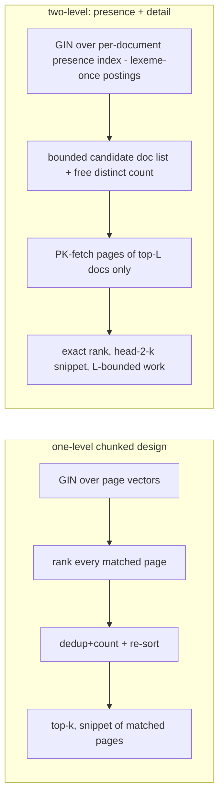

# Structures and techniques for maximizing full-text search performance at our scale

Research note. Goal: beyond the page-chunking of `tsvector`
(the `document_chunk` design), survey alternative database structures — generalizable to any
"collection of subunits per parent entity" problem — that could squeeze further retrieval
performance, with measured gains, effort, and risk for this app. Search and text retrieval
are first-class features here, so ranking, snippeting, counting, and combined
text+metadata queries all count against the clock. Roadmap item 407
(single-store benchmark at 10k–100k+ documents) is the natural home for the numbers this
note asks for.

## Context — measured baseline (live instance, ~42k documents, 2026-09-02)

From the local benchmark run against `GET/POST /api/v1/documents/search` (full detail in
`.kilo/reports/search-retrieval-bench-42k.md`, gitignored):

| Workload (42.2k docs) | Time | Cause |
|---|---|---|
| broad `q=of` (40.7k matches), `limit=20` | 0.66 s | rank + snippet over all matches |
| narrow phrase (110 book matches) | **2.35 s** | `ts_headline` over full text of every hit — cost ∝ hit **length**, not count |
| `offset` sweep, `q=government` (10.9k) | 0.56 → 30.7 s linear in offset | targetlist expressions (`text_content` + `ts_headline`) evaluate at the scan node, for every row, *before* `LIMIT`/`OFFSET` discards them |
| offset past end (returns 0 rows) | 31–53 s | same, no guard |
| metadata-only filters incl. `count` over 42k, deep offset 30k | ≤ 150 ms | B-tree + joins already healthy |
| zero-match FTS | ~2 ms | GIN short-circuits |
| +COUNT (broad) / per-returned-row | +0.31 s / ~2 ms | modest |
| 10× parallel broad | wall ≈ single-request | no contention at this scale |

Implication: the cost center is **per-candidate-row work (rank + detoast + headline)**, and it
is currently multiplied by every *document*. All layout options below are judged by how much
per-candidate work they remove or bound.

## Framing fact — what Postgres structurally cannot do

The performance literature on inverted indexes is essentially one family of ideas: store
**impact/score upper bounds beside the postings and skip anything that cannot reach top-k**
— the two-level/dynamic-pruning lineage (WAND and MaxScore) and its block-max refinements
(block-max WAND/BMM; Dimopoulos et al. 2013; Tonellotto & Macdonald 2020 for a current
survey), with modern state of the art in Block-Max Pruning (Mallia et al. 2024). Postgres'
GIN cannot express any of it: an entry is
`key → posting list of heap TIDs` with no tf, no weights, no bounds; `ts_rank` happens after
heap fetch. Consequences:

- Exact top-k ranking over `tsvector` is always **exhaustive over all matches** — layout can
  reduce the size and width of what is scanned, never terminate it early.
- The only "early termination" valve in the box is the `gin_fuzzy_search_limit` GUC, which
  makes conjunctive answers approximate (a random-capped subset) — usable for a latency-capped
  autocomplete, not for the main search path.
- The billion-document tricks in that literature (hierarchical/synopsis indexes,
  arXiv:2608.00229) target an index that no longer fits in RAM. At 10⁴–10⁵ documents our GIN
  is a few hundred MB of hot cache at most: at our scale the battle is *row width × candidate
  cardinality × caching*, not pruning.

Everything below is scored against that baseline. S-names reused across reports.

## Structures surveyed

### S1 — Uniform page-chunk child table (the accepted base design)

GIN over one `tsvector` per ≤4k-word chunk; document-level results via `max(ts_rank)`/
`sum(ts_rank)` grouped by document. Removes the hard 1 MB cap and the 16,383-position clamp,
bounds `ts_headline` to page text (kills the 2.35 s/110-hits pathology), converts the
`left()`-truncation workaround into nothing. **Costs introduced:** rows ×page-per-doc for
ranking and dedup; `count(DISTINCT)` for pagination; GIN posting lists grow to TID-per-page;
result-order semantics shift (rank aggregation). This is the agreed baseline the rest of this
note tries to beat.

### S2 — Narrow/wide split of S1 (attribute partitioning) — free, do it anyway

`document_chunk_idx(document_id, seq, tsv)` carries **only** what matching+ranking touch
(GIN recheck and `ts_rank` read the vector and nothing else); page text lives in a separate
relation joined only for the final ≤`limit` snippets. Effect on the baseline: heap pages
touched during bitmap recheck drops ∝ row narrowing, and snippet I/O happens for ~tens of
rows instead of thousands; combined with the two-phase query shape (rank→limit→join) that
already appears in the 42k report's recommendations, it makes per-skipped-row work
microsecond-scale — which is what the offset pathology (currently ~3.5 ms/row) needs to
disappear without giving up OFFSET pagination. No semantic change. Risk: negligible. Note the
PK `(document_id, seq)` is the *structure index* the detail work then reads by — the
"integrate structure indexes with inverted lists" pattern of Kaushik et al. (2004), which is
exactly the second-level access shown in the two-level diagram.

### S3 — Two-level index: per-document presence rows + per-page detail rows

The closest transplanted idea from the top-k literature: a small coarse structure (two-tier
score-safe indexes, Daoud et al. 2016; "coarse indexing, fine evidence", arXiv:2608.23011)
prunes globally, and the expensive level is touched only for a bounded candidate set.

- `document` grows a **presence** column: sorted unique lexemes (either as a
  positions-stripped `tsvector` built from the chunk vectors' `tsvector_to_array` union, or
  a `text[]`) with its own GIN/`array_ops` support. Postings are **per document** → every
  term's list is ~df(docs) short (the 42k data has `of` → 40.7k rows but that's the whole
  table; the useful term `government` → 10.9k TIDs instead of potentially 10.9k × avg-pages),
  each row appears once → **dedup and `count` are free**.
- Stage 1: match on presence + metadata, order by a cheap presence-level signal, take top
  `L` documents (L ≈ 20× page size).
- Stage 2: fetch those L docs' chunks **over the PK btree** (no global chunk-bitmap), rank
  exactly, snippet, return k.

Gains vs S1/S2: replaces the two costs S1 introduced (dedup+count over page rows on broad
queries; ranking all matched pages) with a bounded second level. Exact top-k guarantee is
weakened — presence scores can't bound page-level `max(ts_rank)`, so the result is "exact
top-k inside a generous candidate set"; with `plainto_tsquery`'s AND semantics the *matching*
relation itself stays exact (a query matching pages of a doc iff the doc's presence set
contains all terms), so the approximation lives in ordering only, tunable by L. Prefix
queries would bypass presence (`&&` needs exact lexemes), same operator caveat. Effort: extra
maintenance of the presence column in consume + backfill; moderate. **Only adopt behind a
benchmark** (see Verdict) — with S2's narrow rows and the two-phase query, S1's remaining
broad-query cost is `~#matched-pages × µs`, and S3 is competing for that residual.

### S4 — Storage-level squeezes (all percent-level, some trivial)

- **Chunk width vs TOAST:** keep per-chunk vectors *inline*: row values under the ~2 KB
  TOAST threshold avoid out-of-line fetches during recheck. Measure `pg_column_size(tsv)`
  over sample pages; chunk word count is the knob (500–900 words often lands inline
  compressed with the PG 14+ lz4 default; `STORAGE MAIN` retains compression, `EXTERNAL`
  trades size for CPU — test both). Multi-byte-heavy languages shrink the word budget.
- **Physical clustering (document-ID reordering):** reassigning IDs so related docs are
  adjacent is a documented multiplier for compressed-posting traversal (surveyed in
  arXiv:2104.08976 §"indexing and query processing"); Postgres' equivalent is *insertion
  order*: backfill chunks grouped by content-similar clusters (cheap proxies: `language`,
  `document_type`; better: offline tf-graph partition in a one-off script), and let consume
  inherit the locality. Effect: bitmap heap scans touch contiguous pages; few %, but free.
- **Partial indexes for soft-delete:** a live-only flag denormalized to chunk rows enables
  `WHERE is_live` partial GIN — trashed documents stop inflating posting lists until purge.
- `(document_id, seq)` PK btree doubles as reassembly-order access (no extra index).
- Maintenance/ingest: keep GIN `fastupdate` on with a tuned `gin_pending_list_limit` for
  batch re-ingests; autovacuum keeps pending lists merged — on the 42k corpus ingest bursts
  were not measured, flag in the benchmark plan.

### S5 — Immutable segments: partition the chunk table by ingestion batch (≈ month)

The LSM/segment architecture that Lucene derivatives get cache locality and merge-friendly
indexes from. In PG: range partition on a monotonic ingest column; per-partition GINs stay
small/hot; tier-2 date-bound queries partition-prune; a re-consume writes a *new segment* —
read paths union over live segments — approximating Lucene's immutable-segment merge. Cost:
cross-partition ordering work multiplies, partition count management, migration complexity.
At our sizes, partitioning buys cache heat only if older segments are genuinely cold — i.e.,
only if user behavior shows date-windowed search. **Park**: revisit if a corpus of mixed
vintages shows date filters to be hot.

### S6 — Precomputed answers: saved-search result cache + keyset + count caches

The "first-stage that never scores": materialize top-k document lists per hot query and
refresh incrementally. Evidence this is the right axis here: the app *has* saved searches and
a small user base ⇒ query workloads repeat (the 42k tag vocabulary is dominated by a few
hundred common terms). Shape: `search_result_cache(search_id/params_hash, seq, document_id,
rank, built_at)`; invalidated per ingest by an epoch counter, rebuilt incrementally (one new
doc merged into the sorted list — top-k incremental update, the TAAT-side cousin of the
literature's incremental indexing). Related micro-versions: cached `total` per query hash
for pagination (kills the count), rank-cursor keyset pagination (`WHERE rank < $cursor
LIMIT n`) for the UI instead of OFFSET. Risk: staleness policy is a product decision. This is
the option most orthogonal to storage layout — it can be added at any time post-S1.

### S7 — In-database search engine: ParadeDB `pg_search` (the asymptotic escape hatch)

The one structure in this survey that **changes query-path asymptotics** inside Postgres: a
tantivy-based BM25 index with skip-list/impact-carrying postings (the WAND/BMW family
productized), top-k early termination, highlighting, and **filter push-down into the index**
— i.e., the combined text+metadata conjuncts of Tier-2 are evaluated inside the scan instead
of bitmap-AND'ing GIN against btrees. "One Postgres for your application data, full-text
search, vector…" (verified from the repo README, 2026). Caveats, each potentially
disqualifying for this project's posture: distributed via a **custom PostgreSQL image**
(no stock `postgres:17`/`podman run` install path — collides with the deployment model that
AGENTS.md describes); **AGPL-3.0**; BM25 replaces `ts_rank` ordering (re-tune ranking UX);
extension adds backup/restore surface (pg_search indexes inside `pg_dump` flows). Verdict:
**the designated challenger inside roadmap item 407**, benchmarked in a fork exactly so the
zero-dependency choice stays measured, not doctrinal — at our measured baseline (sub-second
broad queries pre-chunking), chunked S1/S2 has every chance of being "fast enough", and
nothing earlier in this note beats that operational story.

## Ideas checked and killed (completeness)

| Idea | Why dead |
|---|---|
| One row per document with `tsvector[]` of page-vectors | no `@@`/`||` operator for `tsvector[]` exists in core (verified against §9.13 operators, PG 18) — array would be inert text-search-wise; generic GIN `array_ops` treats elements opaquely w.r.t. tsquery matching logic |
| Hand-rolled postings as SQL rows (`lexeme, chunk, tf` + btrees) | re-implements GIN's posting lists with ~100-byte tuple overhead — strictly worse constants; GIN's *format* isn't the missing part anyway |
| GiST for tsvector | lossy fixed-length signatures ⇒ false matches + heap rechecks (docs §12.9); designed for append-heavy corpora (pg_trgm-style), not ours |
| Index synopses for latency prediction (arXiv/ACM TOIS 10.1145/3389795) | predicts *which* queries run long; interesting ops tool, not a speed structure here |
| Learned-sparse/early-termination literature (DeepImpact/SPLADE traversal work, MaxScore-guided) | requires per-posting learned weights — no hook exists in Postgres types |
| `wal_log_hints`/`fillfactor` tuning on chunk table | micro-noise; fold into S4 measurements |

## Verdict and benchmark plan

1. **S1 + S2 (chunk, then narrow):** strict improvements on the measured baseline, no
   semantic risk. Adopt together as the chunking migration's shape (already proposed;
   snippet cost → page-size, offset cost → per-skipped-row µs).
2. **S6 cached totals + keyset + saved-search top-k cache:** first follow-up; highest
   measured-baseline upside per unit risk for the *common* path (the 42k numbers say
   hot-term repetition + count + OFFSET are where seconds live).
3. **S4 micro-knobs** (chunk width vs ~2 KB, clustering order, live-partial GIN):
   measure-in-one-afternoon each; include in the acceptance benchmark.
4. **S3 two-level:** build only if benchmarking S1+S2 shows broad 1–2-term queries still
   dominated by page-row dedup/candidate volume (i.e., residual ≈ #matched_pages > ~10⁵);
   decide with the same rig as 407.
5. **S7 pg_search:** time-boxed trial in the roadmap-407 fork — the honest way to keep
   "Postgres-only" as a measured decision rather than an assumption.

Measurement harness to settle all of the above (extend the 42k script): per-scenario
`EXPLAIN (ANALYZE, BUFFERS)`; `pg_stat_statements` percentiles per query class
(broad/medium/narrow/offset-deep/combined-metadata/date); `pg_column_size` profiled chunk
tables at 3 candidate word-counts; the offset-sweep and limit-differential probes as
regression tests (targets: offset ≈ flat; `q=finite element method` < 200 ms post-S2).

## Limitations

The 42k baseline is one host, one corpus vintage, LAN single-client; the linear-offset
coefficient (~3.5 ms) will drop with S2's two-phase rewrite regardless of layout, so S3/S7
gains must be quoted against *post-S2*, not against today's numbers. GIN tuning claims
(`fastupdate`, pending list) match the docs at time of writing but have not been benchmarked
under this ingest shape. `gin_fuzzy_search_limit` was verified present in the GUC docs, not
empirically profiled (expected disuse).

## References

APA (search literature — only records directly retrieved this session are cited with DOIs;
the WAND/MaxScore/BMW lineage referenced in-text is described within the Mackenzie/Dimopoulos/
Tonellotto records below rather than cited blind):

- Daoud, C. M., de Moura, E. S., & Carvalho, A. L. (2016). Fast top-k preserving query
  processing using two-tier indexes. *Information Processing & Management, 52*(5), 855–872.
  https://doi.org/10.1016/j.ipm.2016.03.005
- Dimopoulos, C., Nepomnyachiy, S., & Suel, T. (2013). Optimizing top-k document retrieval
  strategies for block-max indexes. *ECIR '13*, 113–122. https://doi.org/10.1145/2433396.2433412
- Kaushik, R., Krishnamurthy, R., & Naughton, J. F. (2004). On the integration of structure
  indexes and inverted lists. *SIGMOD '04*, 779–790. https://doi.org/10.1145/1007568.1007656
- Mackenzie, J., Petri, M., & Moffat, A. (2021). Anytime ranking on document-ordered indexes.
  arXiv:2104.08976. https://arxiv.org/abs/2104.08976
- Mallia, A., Suel, T., & Tonellotto, N. (2024). Faster learned sparse retrieval with
  block-max pruning. *SIGIR '24*, 2411–2415. https://doi.org/10.1145/3626772.3657906
- Tonellotto, N., & Macdonald, C. (2020). Using an inverted index synopsis for query latency
  and performance prediction. *ACM TOIS, 38*(3), 1–33. https://doi.org/10.1145/3389795
- Hierarchical BM25: Lexical search at billion-document scale. (2026). arXiv:2608.00229.
  https://arxiv.org/abs/2608.00229
- Coarse indexing, fine evidence: Decoupling temporal granularity in long-video RAG. (2026).
  arXiv:2608.23011. https://arxiv.org/abs/2608.23011

Engineering sources (verified this session):

- PostgreSQL docs — §12.11 Limitations (tsvector caps):
  https://www.postgresql.org/docs/current/textsearch-limitations.html
- PostgreSQL source — `ts_type.h` bitfields:
  https://github.com/postgres/postgres/blob/master/src/include/tsearch/ts_type.h
- PostgreSQL 18 release notes — parallel GIN index build:
  https://www.postgresql.org/docs/18/release-18.html
- PostgreSQL docs — §9.13 text-search operators (no array operands):
  https://www.postgresql.org/docs/18/functions-textsearch.html
- PostgreSQL docs — §12.9 index types (GiST lossiness):
  https://www.postgresql.org/docs/18/textsearch-indexes.html
- ParadeDB (pg_search) repository:
  https://github.com/paradedb/paradedb
