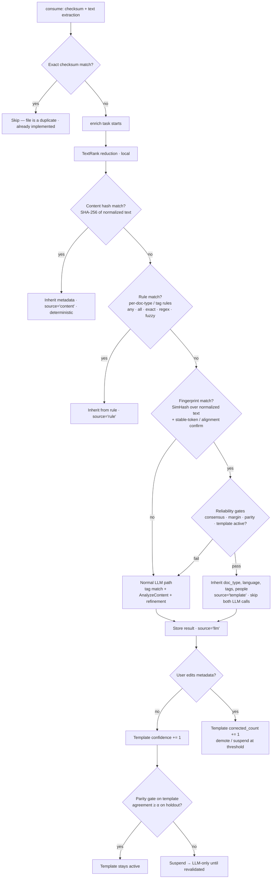

# Deterministic Fast Path to Skip LLM on Recurring Documents

Research for roadmap item 83 (moved to Icebox). Goal: eliminate the per-document LLM
call for recurring document types (invoices, statements, forms) by matching new
documents against already-classified ones and inheriting metadata with an acceptable
degree of reliability.

## Context — how enrichment works today

- `consume` computes MD5/SHA512 over **file bytes** at scan time and skips byte-identical
  duplicates entirely (no document row, no enrich task — `internal/consumption/scan.go`,
  `consumer.go`). Every document that reaches `enrich` therefore has a unique file.
- `enrich` (`internal/enrichment/enricher.go`) then runs: TextRank reduction (local) →
  semantic tag matching via Hugot/bge-m3 embeddings (local) → LLM content analysis
  (title, doc type, language, tags, people — 1 call) → doc-type refinement (optional
  2nd LLM call on head+tail text). Tag/people consolidation is local.
- So every non-duplicate document costs 1–2 LLM calls, regardless of how many
  near-identical ones preceded it.

### Three levels of "sameness" — the key distinction

| Level | Signal | Same means | Status |
|---|---|---|---|
| Byte (file) | MD5/SHA512 of the file | Same file re-imported → **skip** | Already implemented (scan-time) |
| Content (text) | Hash of normalized extracted text | Same document, different bytes → **inherit deterministically** | Not implemented — cheapest new tier |
| Template (structure) | Fingerprint / embeddings of text | New instance of a recurring template → **inherit via similarity + gates** | Core of this item |

The checksum dedup is against the *file*; this item is about the *content*. A content
hash is a legitimate deterministic tier: two files with different bytes (re-exported
PDF, regenerated download, re-scanned page) can carry identical extracted text.

## Problem decomposition

1. **Match identification** — "is this document an instance of a template we already
   classified?" (recall problem)
2. **Reliability assurance** — "if we inherit metadata, how do we bound the error
   rate?" (precision problem)

The literature converges on the same answer for both: a **cascaded pipeline that
defers to the LLM on anything uncertain**. A cheap deterministic/learned stage handles
the easy majority; the LLM remains the baseline for everything else. Errors only
happen on *acceptance* — deferral never causes an error — so the false-positive rate
can be pushed arbitrarily low at the cost of coverage.

## Findings

### Exact content matching (content hash) — deterministic tier

- SHA-256 over normalized extracted text (lowercase, whitespace collapse, Unicode fold
  via the already-imported `github.com/anyascii/go`).
- **Conservative by construction**: identical normalized text ⇒ same document ⇒ doc
  type, language, tags, people are definitionally the same. A content-hash match can
  never match the *wrong* document; failures are only *misses* (OCR/extraction
  variance → fall through to LLM), never false positives.
- Covers *same-instance re-imports* (same statement re-downloaded, same invoice
  re-exported). The monthly recurrence (next invoice number, next month's statement)
  has different content too and needs the template tier.
- This is the "duplicate detection by template matching" problem in its simplest form
  — deterministic hash comparison; the classic operational concerns (primary + subordinate
  detector) are covered below for the near-duplicate tier [Caprari 2000].

### Near-duplicate fingerprinting: SimHash + confirmatory alignment

- Production deployment over 224,398 medical documents: **SimHash (LSH) as a cheap
  primary filter, then Smith–Waterman alignment as a confirmatory check** → AUC 0.96,
  sensitivity 0.92, specificity 1.00, PPV 1.00 on 1,650 manually verified pairs
  [Niemi et al. 2025]. Two-stage design is what buys near-zero false positives; the
  confirmation only runs on the few candidates.
- Classic line: shingling/MinHash (Broder), SimHash (Charikar), 64-bit fingerprints
  with Hamming distance ≤ 3 for web-scale near-duplicates (Manku et al. 2007).
- **Key trick for this domain**: normalize text *before* hashing — lowercase,
  Unicode-fold, collapse digits/dates/amounts to placeholders (`INV-2024-0147` →
  `INV-####`). Then every instance of the same vendor's invoice lands in the same
  neighborhood even though values differ.

### Template-level clustering with embeddings

- Unsupervised clustering of documents at category *and template* level with frozen
  multimodal encoders [Sampaio et al. 2025, BNP Paribas]:
  - Vision/layout encoders (DiT, Donut) reach ARI > 0.99 on clean pages (10,000
    synthetic invoices, 50 templates).
  - Text-only (SBERT) is weaker on clean docs (ARI 0.86) but **stable under scan noise
    where vision collapses** (Transformed FATURA); fused encoders (LayoutLMv3, Donut,
    Gemma3, InternVL3) are the best trade-off.
  - HDBSCAN + k-NN gives noise-free partitions and flags new templates as outliers —
    free template-drift monitoring.
- Implications: layout/visual signals are the strongest template discriminators but
  the first to break under scanning artifacts; a text signal is the robustness
  backbone for scanned paper. Template drift surfaces as unmatched documents, not
  silent misclassification.

### Template structure inference (TWIX)

- Templatized documents are generated by populating fields in a visual template;
  **fields appear at consistent positions across instances while values vary**
  [Lin et al. 2025, UC Berkeley]. Template = tree of table/key-value blocks.
- >90% precision/recall on 34 real-world datasets; 734× faster and 5,836× cheaper
  than vision-LLMs for extraction.
- Transfer for metadata inheritance: you don't need value extraction — only to know
  that two documents share a template. Position-consistency is one cheap confirmatory
  signal for born-digital PDFs (requires layout data, which `text_content` alone lacks).

### One-shot template matching in production (Docsumo)

- Closest published industry system: a template library, new docs matched via visual
  similarity (SVD) + fuzzy text match of top/bottom lines, text threshold as the gate,
  **user corrections fed back into the template library** [Dhakal et al. 2019].
- **86.4% accuracy on 595 real invoices (35 templates)** with one annotated example
  per template. Confirms both the mechanism and the feedback loop.

### LLM cascades and the reliability machinery

- **TRACER** [Rida 2026]: trains a cheap surrogate on the LLM's own production traces
  (every enrich call is already a labeled pair), activates it only after a **parity
  gate** (agreement with the teacher ≥ α on held-out data), defers via a confidence
  **acceptor** (top-1 prob, margin, entropy — not raw probability). Results: 83–100%
  coverage on intent classification; the gate **refuses deployment when the task is
  not separable from embeddings** (MNLI: 0% coverage at every α) — exactly the safety
  property wanted here.
- **Conformal Cascade** [Dou et al. 2026]: replaces threshold tuning with conformal
  prediction sets — accept when the calibrated set collapses to a single answer,
  defer otherwise; **distribution-free finite-sample error bound ≤ Kα**; the user's
  error budget α is the only knob. Doc type is a finite label set, so this is
  genuinely applicable (tags are multi-label — use per-tag agreement instead).
- **FrugalGPT** [Chen et al. 2023]: cascade framework; cost reductions up to 98% on
  easy-majority workloads.
- **SemHash-LLM** [Fang et al. 2026]: validates the funnel principle — Bloom filter →
  semantic hash blocking → attention-weighted MinHash → neural verification on <1%
  of pairs; LLM-as-judge only on borderline cases (~3% of pairs).

### Practical precedent: paperless-ngx

- Rule tier: per-tag/correspondent/type match algorithms (`Any`, `All`, `Exact`,
  `Regex`, `Fuzzy`) — user-authorable, deterministic, auditable.
- Learned tier: an "Auto" neural classifier trained on the user's own documents,
  retrained periodically, and **only learns from documents the user confirmed**
  (excludes inbox-pending docs). Needs positive and negative examples; correlation
  between text and label is a documented prerequisite.
- Strongest existence proof that the hybrid (rules + classifier trained on a
  verified corpus) is viable in exactly this use case.

## Recommended design

### Matching tiers, mapped to this codebase

| Tier | Mechanism | Where it lives | Cost | Reliability |
|---|---|---|---|---|
| 0 | File checksum inheritance | `md5_checksum`/`sha512_checksum` at scan (dedup — no inheritance) | ~0 | 100% (but only catches byte-identical files) |
| 1 | **Content hash** — SHA-256 of normalized extracted text | New `content_hash` column on `document`; check at top of `Enricher.Enrich` | ~0 | Effectively 100%: conservative, misses-only |
| 2 | User rules (paperless-style match algorithms) | New config per `document_type`/tag; evaluated on `text_content` | ~0 | Deterministic, user-auditable |
| 3 | **SimHash over normalized text** (digits→`#`, anyascii fold) + Hamming ≤ 3, then stable-token Jaccard or alignment confirmation | New; operates on `text_content` — no new extraction | ~0 | Near-zero FP when confirmed (PPV 1.00) |
| 4 | Embedding k-NN using existing bge-m3/Hugot infra (`hugot.go` already has chunked `Encode` + `meanPool`; reduced text is already computed) | Reuse `tagmatcher` client + `cache.EmbeddingStore` pattern | 1 local inference | Moderate; needs margin + consensus gates |

At personal-DMS scale (thousands of documents), brute-force Hamming/cosine scans are
microseconds — no pgvector or LSH bands needed. A `bigint` column + plain index
suffices.

### Integration points

- `content_hash`: computed at consume completion (text is available there); indexed.
- Fast-path check at the top of `Enricher.Enrich` — after reduction/tag matching,
  before `AnalyzeContent`. On a match, construct the `tools.ContentAnalysisResult`
  from the template's stored metadata, skip `AnalyzeContent` *and* doc-type
  refinement, jump to the existing normalization/consolidation steps. Two LLM calls
  eliminated per matched document.
- Provenance: `enrich_source` ('llm' | 'content' | 'rule' | 'template') + matched
  `template_id` on `document`, surfaced in the UI with the existing ReEnrich
  endpoint as the correction path.
- Config: `enricher.fastpath.enabled` + thresholds (hamming, jaccard, margin,
  min_members, parity α, correction limit), following the existing `EnricherConfig`
  pattern.

### What to inherit vs. not

- *Inherit*: `document_type_id`, `language`, tag set, people (sender) — the stable fields.
- *Don't inherit*: title verbatim (it embeds the varying invoice number/date). Inherit
  only a title *pattern* if the template's titles are stable modulo placeholders;
  otherwise leave the current filename-based default.

## The reliability layer — what makes it "acceptable"

1. **Learn only from verified documents** (paperless-ngx; TRACER). Templates are built
   from docs whose metadata survived a review window (e.g., no user edit within N days)
   or was human-confirmed. Never from raw LLM output alone.
2. **Parity gate before activation** (TRACER). A template only goes live when
   inherited-metadata agreement on a held-out set of its members ≥ α (start ≈ 0.95).
   If no template passes, nothing changes — the LLM path is untouched.
3. **Consensus + margin**: require the top-2/3 candidates to agree on doc type, and a
   minimum similarity margin between best and second-best. Two similar-looking
   vendors → disagreement → defer.
4. **Defers are free; errors only on acceptance** (Conformal Cascade / cascade
   theory). Any uncertainty (new layout, low similarity, first occurrence, tiny
   cluster, OCR-heavy scan) falls through to the LLM. Minimum template membership
   k ≥ 3 before matching.
5. **Formal error budget (optional escalation):** doc type is a finite label set, so
   split-conformal calibration of the acceptance threshold gives a distribution-free
   bound on inherited-doc-type error ≤ α (Conformal Cascade, Theorem 2).
6. **Feedback loop** (Docsumo; TRACER flywheel): user corrections demote/suspend
   templates (correction-rate threshold), and each corrected document becomes a
   better reference example. Template drift surfaces as unmatched docs rather than
   silent misclassification.

## Expected economics

For a personal DMS, recurring documents are typically the majority of volume, and each
currently costs 1–2 LLM calls plus latency. Benchmarks for the same mechanics: Docsumo
86% one-shot accuracy on real invoices; TRACER 83–100% coverage at α=0.95;
FrugalGPT-style cascades report cost reductions up to 98% on easy-majority workloads.
With consensus + parity you trade some coverage (docs that *could* inherit but defer)
for near-zero added error — the correct trade for metadata searched for years.

## Suggested incremental rollout

1. **Tier 1 content hash** — deterministic inheritance for same-document re-imports
   (smallest effort, zero risk, immediate hit rate on re-downloads).
2. **Tier 2 rules** — paperless-ngx-style match algorithms per doc type/tag.
3. **Tier 3 fingerprints** — SimHash over normalized text + two-stage confirmation,
   with provenance columns, gates, and the correction loop. Delivers most of the
   item's value.
4. **Tier 4 embeddings** — only if recall is insufficient; the bge-m3/Hugot
   infrastructure already deployed for tag matching makes this incremental.

The consistent finding across all sources: the fast path must be **conservatively
activated, auditable, and correctable** — then a similarity match against
already-classified documents is not a gamble, it is a bounded-cost optimization.

## Sources

- Caprari, *Duplicate document detection by template matching*, 2000 —
  https://consensus.app/papers/details/d056d4afad865d38af5152b77dfec8c2/
- Niemi et al., *Automatic (near-)duplicate content document detection in a cancer
  registry*, 2025 — https://consensus.app/papers/details/ebe733b07be6519aa3e5f3761d23f9f5/
- Sampaio et al. (BNP Paribas), *Unsupervised Document and Template Clustering using
  Multimodal Embeddings*, 2025 — https://arxiv.org/abs/2506.12116
- Lin et al. (UC Berkeley), *TWIX: Automatically Reconstructing Structured Data from
  Templatized Documents*, 2025 — https://arxiv.org/abs/2501.06659
- Dhakal et al. (Docsumo), *One-Shot Template Matching for Automatic Document Data
  Capture*, 2019 — https://arxiv.org/abs/1910.10037
- Rida, *TRACER: Trace-Based Adaptive Cost-Efficient Routing for LLM Classification*,
  2026 — https://arxiv.org/abs/2604.14531
- Dou et al., *Conformal Cascade: Distribution-Free Accuracy Guarantees for Multi-Tier
  LLM Inference*, 2026 — https://arxiv.org/abs/2607.25018
- Fang et al., *SemHash-LLM: A Multi-Granularity Semantic Hashing Framework for
  Document Deduplication*, 2026 — https://arxiv.org/abs/2607.01601
- Chen et al., *FrugalGPT: How to Use Large Language Models While Reducing Cost and
  Improving Performance*, 2023 — https://arxiv.org/abs/2305.19291
- Charikar, *Similarity Estimation Techniques from Rounding Algorithms*, 2002
- Manku et al., *Detecting Near-Duplicates for Web Crawling*, WWW 2007
- Paperless-ngx advanced usage (matching algorithms, Auto classifier) —
  https://docs.paperless-ngx.com/advanced_usage/
