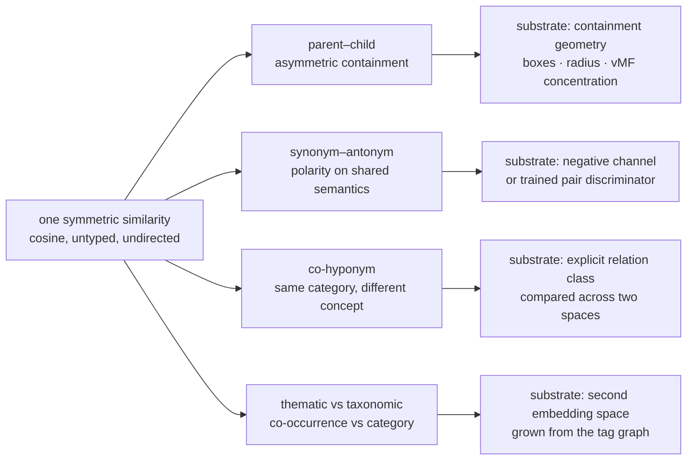
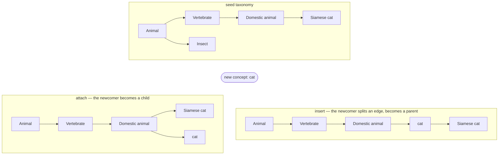
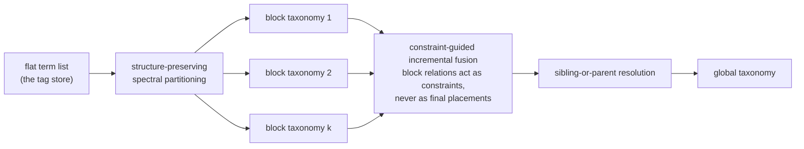
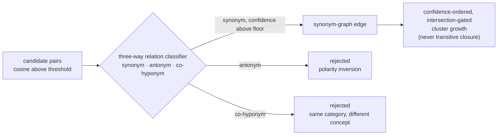
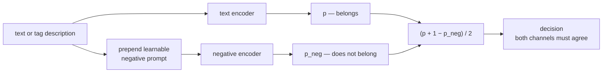
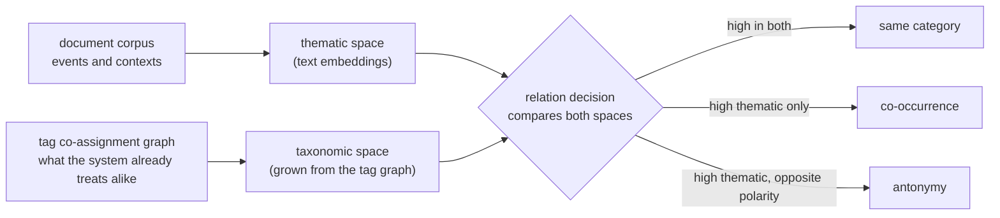
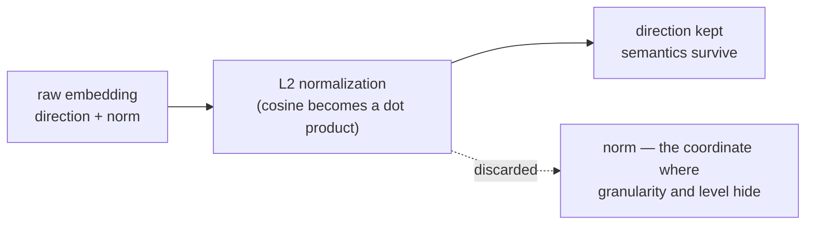
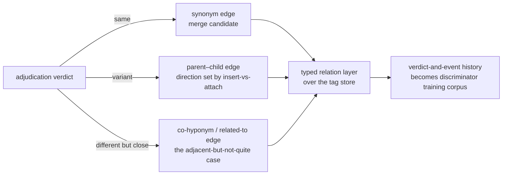

# Tag Relationship Architectures — A Conceptual Survey of Experimental Patterns

Research note. Conceptual and theoretical exploration only: how the tag vocabulary
could move from a single untyped similarity signal toward typed, directed
relationships — parent–child (subsumption), synonym–antonym (polarity), and
adjacent-but-not-quite-related (shared category vs co-occurrence). The motivating
defect, observed at length in the production matcher log, is that consolidation
forces one symmetric cosine score to answer questions that are typed and
directional: `machine learning → deep learning` (broader absorbed into narrower),
`anti fascism → fascism` (polarity inversion at 0.927), `individualism →
isolationism` (siblings collapsed). Embedding similarity measures *topical
relatedness*; every architecture below is an attempt to recover the relation type
that relatedness erases.

---

## 1. The common thread

Every surveyed line of work attacks the same root problem from a different side:
**a single symmetric similarity must be factored into typed, directed relations,
and each relation type wants its own architectural substrate** — a geometry with a
direction of containment, a second encoder for opposition, a second embedding
space grown from different data, a trained pair classifier, or a definitional
representation. Cosine in one text-embedding space gives exactly one relation:
undirected, untyped relatedness. Hypernymy is asymmetric, antonymy is polarity
along shared semantics, and co-hyponymy is *same category but different concept* —
none of these is expressible as a threshold on that one score.

---

## 2. Parent–child: asymmetry needs containment geometry

The core theoretical obstacle: subsumption (`democracy` ⊃ `direct democracy`) is
asymmetric, while cosine is symmetric. No cutoff on a symmetric score can express
"A contains B but B does not contain A". Three experimental families solve this by
giving the representation a coordinate whose meaning is *level* or *containment*.

### 2.1 Boxes: insert vs attach as a first-class decision

TaxBox [5] (arXiv:2305.11004) embeds each concept as an axis-aligned
hyperrectangle; the parent–child relation becomes probabilistic volume containment
`Pr(box_child | box_parent)`, inherently asymmetric. Its most consequential idea
for tag systems is that enriching a taxonomy has **two operations, not one**:
*attach* (a new concept becomes a child of an existing node) and *insert* (a new
concept becomes a parent of some existing children, splitting an edge). The
`democracy → direct democracy` failure is precisely an unanswered insert-vs-attach
question — the direction of the placement is an explicit output of the
architecture with dedicated scorers, rather than an error discovered after a
symmetric nearest-neighbor decision. TaxoBell [9] (arXiv:2601.09633) extends the
box family with Gaussian boxes for self-supervised expansion, softening hard box
boundaries into distributions.

### 2.2 Polar geometry: angle is meaning, radius is level

Polaris [6] (arXiv:2605.00265) places concepts on a hypersphere and deliberately
decouples two signals that cosine entangles: **direction encodes semantics,
radius (an "orbital potential" derived from the hierarchy) encodes level**. Each
concept is additionally a von Mises–Fisher distribution whose concentration
encodes semantic granularity: broad parents are high-entropy, low-concentration;
narrow children the reverse. Containment is then an asymmetric vMF–KL objective —
a formal, learnable version of "machine learning is broader than deep learning"
as a geometric property rather than a judgment call. The paper is also candid
about why prior polar attempts failed (angular optimization instability) and how
global regularization prevents embedding collapse — a useful map of the failure
modes, not just the idea.

### 2.3 Hyperbolic geometry

The foundational line: Nickel and Kiela [7] (arXiv:1806.03417) learn continuous
hierarchies in the Lorentz model of hyperbolic space, where exponential volume
growth with radius naturally accommodates tree-like structure —
distance-from-origin becomes depth. HyperExpan [8] (arXiv:2109.10500) applies
this to taxonomy expansion. For a tag system, the conceptual claim is that
*sibling crowding* and *level separation* are geometric problems: in Euclidean
space, many siblings under one parent pile up near each other and near the
parent; in hyperbolic or polar space, capacity grows with depth.

### 2.4 LLM induction with constraints, not ground truth

SPARROW [10] (arXiv:2609.07307) induces a full taxonomy from a *flat list of
terms* — structurally the same input as a tag store — via a divide-and-merge
pipeline, and its two named failure modes map one-to-one onto consolidation
pathology:

- **Structural fragmentation** — partitioning severs cross-block parent–child
  signal, exactly like parent concepts and child concepts born in different
  documents never seeing each other;
- **Parent displacement** — locally plausible relations end up misplaced
  globally, exactly like `spanish revolution → mexican revolution`: topically
  close, structurally wrong.

Its answer is the deepest pattern in this family: block-level judgments act as
**constraints that scope candidate placements, never as final decisions**, and a
sibling-or-parent resolution step explicitly chooses whether a newcomer joins a
level or creates one. The hierarchy grows incrementally under structural
constraints rather than being induced in one pass — the taxonomy-scale version of
"creation is the default; replacement requires evidence".

### 2.5 A necessary caution: audit the geometry

Kim, Kim, and Jang [11] (arXiv:2607.05268) audit hyperbolic vision–language
models and find that converged checkpoints can remain effectively near-Euclidean
— the claimed geometric mechanism is not always the thing doing the work, and
gains can be operating-point artifacts. Two methodological takeaways for anyone
experimenting here: evaluate hierarchy claims with **ancestor-level metrics**
(is the path to the root right?), not edge-level similarity, because a topically
close wrong parent looks fine on edge metrics while corrupting the tree; and
distinguish the geometry's contribution from what supervision and thresholds
would deliver anyway.

---

## 3. Synonym–antonym: polarity along shared semantics

The diagnosis is consistent across the literature and matches the log: antonyms
*share their semantic domain* — they appear in near-identical contexts and differ
by implicit opposition — so they embed close. Raising the threshold does not
separate them; it only shrinks coverage.

### 3.1 Trained relation discriminators as gatekeepers

The most directly relevant work is Tosun et al. [12] (arXiv:2601.13251), which
built a 15-million-node Turkish synonym graph and documents that raw cosine at
any cutoff admits antonyms and co-hyponyms. Their pipeline trains a **three-way
pair classifier — synonym / antonym / co-hyponym** — reaching 90% macro-F1, and
only synonym judgments above a confidence floor survive into the graph. Two
aspects matter conceptually:

1. **Co-hyponym as an explicit third class** is exactly the
   "adjacent-but-not-quite-related" relation: `social democracy` and
   `direct democracy` are co-hyponyms — same category, different concepts — and
   the classifier's hardest job is separating "same meaning" from "same
   category", which is also exactly where embedding scores are least
   informative.
2. Their training set (843k labeled pairs) was **generated by an LLM for about
   $65** and validated against dictionary resources — a cheap bootstrap path for
   a domain-specific discriminator.

The same paper names the graph-side disease too: **semantic drift** — transitive
chains of locally plausible links (`hot → spicy → pain → depression`) that
connect semantically distant terms. This is structurally identical to absorption
chains in tag consolidation, and their remedy is a principle worth adopting
independently of any architecture: cluster growth must be
**confidence-ordered and intersection-gated, never a transitive closure**.

### 3.2 The negative channel

TSA [2] (arXiv:2505.08168) handles opposition architecturally rather than by
classification: a second text encoder is trained with a *learnable negative
prompt* to produce a "what-this-is-not" embedding, and the decision becomes
`(p + 1 − p_neg) / 2` — positive evidence and negative evidence must agree. The
illustration in the paper is the tag-matcher's problem verbatim: "a paper
published at IJCAI" and "a paper published at The Lancet" differ by a few words
yet are opposites. For tag relations, the pattern suggests an explicit
*dissimilarity channel*: opposition stops being a similarity question and becomes
a second opinion from a representation whose entire job is negation.

### 3.3 Relations as vector offsets and dedicated pair encoders

A smaller but conceptually distinct family treats a relation as the **vector
between** two embeddings rather than a property of their proximity: Luisto [16]
(arXiv:2603.24150) observes that antonym and synonym pairs separate in the
geometry of their *difference vectors*, and Gohourou and Kuwabara [17]
(arXiv:2305.04265) investigate offset clustering for relationship
classification. Industrial versions train dedicated pair encoders: ICE-NET [14]
(arXiv:2401.10045) interlaces two encoders so antonymy and synonymy signals are
learned jointly, and Bhav-Net [15] (arXiv:2508.15792) uses dual-space graph
transformers to transfer the antonym/synonym distinction across languages. The
algebraic shift is the point: the relation type becomes a property of the
*displacement*, not the distance.

### 3.4 Vector surgery

The classical option, counter-fitting [13] (Mrkšić et al., NAACL 2016): post-hoc
adjust the embedding space itself — pull known synonym pairs closer, push known
antonym pairs apart — using a lexical resource of constraints. Cheap and
effective when the constraint list exists; brittle when it does not, which is
the low-resource lesson documented in [12].

---

## 4. Adjacent-but-not-quite-related: thematic vs taxonomic relatedness

Klubička and Kelleher [18] (arXiv:2301.10656) draw the cleanest distinction in
the survey: **taxonomic relatedness** is shared category membership and shared
properties (`dog`–`cat`); **thematic relatedness** is complementary roles in
events and contexts (`dog`–`leash`). Embeddings trained on natural text encode
the thematic kind first, because corpora are made of events and contexts — which
is why a matcher trained on documents cannot tell "same category" from
"co-occurs". Two conceptual consequences:

### 4.1 Two spaces, two relations

The paper builds taxonomic embeddings by running random walks over the WordNet
graph [19] and training on the resulting pseudo-corpus. The generalizable
pattern: a **second embedding space can be grown from the tag graph itself** —
tag co-assignment structure over the corpus is the system's own taxonomic
evidence. A relation judgment then compares the two spaces: high in both spaces
suggests same category; high only in the thematic (document-text) space suggests
co-occurrence; high thematic similarity with opposite polarity suggests
antonymy. The text-embedding store answers "what is this about"; the
co-assignment space answers "what does the system already treat as the same kind
of thing".

### 4.2 The norm is a depth container — and normalization deletes it

The probing result in [18] with the sharpest practical edge: in taxonomically
trained embeddings, hierarchy depth is carried substantially in the **vector
norm** — hypernyms sit farther from the origin than hyponyms — and the norm is a
separate information container from the dimensions. A matcher that L2-normalizes
every embedding (as this one does, to make cosine a dot product) is **norm-blind
by construction**: it discards exactly the coordinate where granularity hides.
The containment geometries of §2 (radius, box volume, vMF concentration) can be
read as principled ways to re-introduce what normalization threw away.

---

## 5. Label-space patterns from zero-shot tagging

### 5.1 Tags as described concepts

Dickinson, Raj GV, and Fung [3] replace tag *names* with tag *definitions*: the
model learns the semantics of a described category and predicts binary
applicability, so tags never seen in training work zero-shot; the whole task is
framed as bipartite link prediction where both sides (documents and tags) keep
growing. The conceptual payoff for relations: `machine learning` vs
`deep learning` as bare names is a nearly-impossible two-token judgment, but as
definitions ("the field of study concerning…" vs "the subfield that…") it is
trivially separable. A tag store whose entries carry generated definitional
text gives every relation decision — matching, consolidation, adjudication — a
far richer substrate than a name embedding.

### 5.2 External knowledge bases as priors

Wang et al. [4] (Neurocomputing 610:128580, 2024) classify text under
fully-unseen labels by integrating **descriptive and structural knowledge from
ConceptNet [20] and WordNet [19]** — typed relations (IsA, AntonymOf, SynonymOf,
RelatedTo) available for free for common concepts — and generate adversarial
hard negatives *from those relations*. The pattern for tag systems: borrow typed
relations from external KBs as **priors to be validated against corpus
evidence**, never as ground truth. A verified prior is not a reliance — this is
the epistemically safe version of pre-seeding the vocabulary.

### 5.3 The seen/candidate split

Split Matching [1] (arXiv:2505.05023), from the segmentation world, contributes
a structural pattern: when one shared assignment channel forces unseen
candidates to compete with seen classes, the seen classes win by default and
candidates collapse into background. The fix is a **separate candidate track**
with its own evidence channel, matched independently. Translated to tag
consolidation: a new concept should not compete in the same argmax that existing
tags win merely by existing — the architectural form of "creation is the
default".

---

## 6. Relation embeddings: the knowledge-graph lineage

The oldest typed-relation machinery is the knowledge-graph embedding family:
TransE [21] models a relation as a translation between entity vectors, RotatE
[22] as a rotation in complex space, ComplEx [23] as a Hermitian product — each
capable of representing *antisymmetric* relations that dot products cannot. For
a tag graph with typed edges (synonym, antonym, parent-of, related-to), these
are the standard off-the-shelf embedders; Polaris [6] contrasts itself with them
directly, noting that they treat hierarchy as just another relation vector
rather than a first-class coordinate. The choice is between *one space with
typed relation operators* (this family) and *geometry with a dedicated level
coordinate* (§2).

---

## 7. Conceptual mapping onto the remediation design

The accepted consolidation redesign — creation as the default, replacement
requiring positive evidence of concept identity, deterministic guards, LLM
adjudication of the ambiguous band with a persistent verdict/event table, a
merge-review surface, and scheduled reconciliation — is already proto-typed in
relation language: the adjudication verdict *same / variant / different* is a
one-bit typed edge. The experimental patterns above describe what that bit can
grow into, without discarding anything already decided:

- **Verdicts become typed edges.** "Same" becomes a synonym edge (or a merge);
  "variant" becomes a parent–child edge whose direction is decided by the
  insert-vs-attach question (§2.1) rather than absorbed; "different but close"
  becomes an explicit co-hyponym or related-to edge — the
  adjacent-but-not-quite case made addressable instead of a threshold accident.
- **The event table is a training corpus.** The pair-and-verdict history that
  adjudication accumulates is exactly the supervision a dedicated relation
  discriminator (§3.1) needs, with LLM-augmented labeling as the cold-start
  bootstrap.
- **Adjudication pressure falls as structure accumulates.** Guards and edges
  answer more pairs deterministically over time; the LLM adjudicates only the
  residue, which is the bounded-cost property the design already relies on.
- **The negative channel and the second space are additive.** Neither requires
  re-architecting the matcher: a negative or taxonomic signal can be consulted
  as *additional evidence* in the same decision point (the probability-averaging
  idea of §3.2 generalizes to any odd number of evidence channels).
- **Priors stay priors.** External KB relations (§5.2) can pre-populate or
  cross-check edges, subject to validation against the corpus's own evidence —
  consistent with the design's rejection of unvalidated catalog reliance.

---

## 8. Synthesis and cautions

The survey supports a specific worldview for tag relationships:

1. **Factor the similarity.** One score cannot serve four relation types; each
   type needs its own substrate — containment geometry for parent–child, a
   discriminator or negative channel for polarity, a second space for
   taxonomic-vs-thematic, definitions for everything hard.
2. **Asymmetry is architectural.** Direction (broader/narrower) is only
   expressible in structures built for it: box containment, radius, cones,
   rotations — or an explicit insert-vs-attach decision.
3. **Anti-transitivity is a design law.** Semantic drift [12] and parent
   displacement [10] are the same disease — locally plausible links chaining
   into globally wrong structure. Confidence gating and constraint-scoped
   growth, never transitive closure.
4. **Audit claims at the ancestor level.** Edge-level and similarity-level
   metrics hide wrong-but-plausible placements [11]; hierarchy quality is
   path quality.
5. **Grow structure under constraints, not in one pass.** The strongest
   scalable result in the survey [10] is a pipeline that treats every local
   judgment as a constraint on a later, better-informed global decision.

What the survey does *not* support: adopting any single geometry as an
unconditional upgrade. Every containment family reports gains against Euclidean
baselines, but the audit literature shows the gains are conditional
on the geometry actually being used. The defensible experimental order is:
typed edges with simple, auditable decisions first; discriminators trained from
the system's own verdict history second; containment geometry where the edge
structure demonstrably outgrows flat similarity.

---

## References

[1] J. Chen, X. Zheng, D. Li, C. Yi, S. Ito, D. P. Paudel, L. Van Gool, H. Murase,
    and D. Deguchi. "Split Matching for Inductive Zero-shot Semantic Segmentation."
    arXiv:2505.05023, 2025.

[2] Y. Wang, X. Yan, S. Jin, Q. Xu, C. Hu, Y. Zhu, B. Du, and J. Jiang. "Exploiting
    Text Semantics for Few and Zero Shot Node Classification on Text-attributed
    Graph." arXiv:2505.08168, 2025.

[3] D. Dickinson, A. Raj GV, and G. Fung. "A Model for Zero-shot Text Multi-labeling
    Using Semantics-based Labels." 2021. IEEE-format manuscript, American Family
    Insurance (no venue recorded in the document).

[4] Y. Wang, W. Wang, Q. Chen, K. Huang, A. Nguyen, and S. De. "Zero-shot text
    classification with knowledge resources under label-fully-unseen setting."
    Neurocomputing 610:128580, 2024. doi:10.1016/j.neucom.2024.128580

[5] W. Xue, Y. Shen, W. Ren, J. Guo, S. Pu, and W. Lu. "Insert or Attach: Taxonomy
    Completion via Box Embedding." arXiv:2305.11004, 2024.

[6] S. Mishra, S. Srinivasan, S. Dasgupta, and T. Chakraborty. "Polaris: Coupled
    Orbital Polar Embeddings for Hierarchical Concept Learning." Proc. ICML 2026.
    arXiv:2605.00265.

[7] M. Nickel and D. Kiela. "Learning Continuous Hierarchies in the Lorentz Model of
    Hyperbolic Geometry." Proc. ICML 2018. arXiv:1806.03417.

[8] M. D. Ma, M. Chen, T.-L. Wu, and N. Peng. "HyperExpan: Taxonomy Expansion with
    Hyperbolic Representation Learning." Findings of EMNLP 2021. arXiv:2109.10500.

[9] S. Mishra, S. Srinivasan, S. Bedathur, and T. Chakraborty. "TaxoBell: Gaussian Box
    Embeddings for Self-Supervised Taxonomy Expansion." arXiv:2601.09633, 2026.

[10] Y. Zhang, Y. Tang, Y. Sun, M.-L. Lee, and A. K. H. Tung. "SPARROW: Scalable
     Taxonomy Induction via Structure-Preserving Partitioning and Constraint-Guided
     Merging." arXiv:2609.07307, 2026.

[11] J. Kim, E. Kim, and D. Jang. "Is the Geometry Doing the Work? An Operating-Point
     Audit of Hierarchy in Hyperbolic Vision-Language Models." arXiv:2607.05268, 2026.

[12] E. Tosun, M. E. Buldur, Ö. Ezerceli, and M. ElHussieni. "Beyond Cosine
     Similarity: Taming Semantic Drift and Antonym Intrusion in a 15-Million Node
     Turkish Synonym Graph." arXiv:2601.13251, 2026.

[13] N. Mrkšić, D. Ó Séaghdha, B. Thomson, M. Gašić, L. M. Rojas-Barahona, P.-H. Su,
     T.-H. Wen, and S. Young. "Counter-fitting Word Vectors to Linguistic
     Constraints." Proc. NAACL 2016.

[14] M. A. Ali, Y. Hu, J. Qin, and D. Wang. "Antonym vs Synonym Distinction using
     InterlaCed Encoder NETworks (ICE-NET)." arXiv:2401.10045, 2024.

[15] S. S. Sanghvi. "Bhav-Net: Knowledge Transfer for Cross-Lingual Antonym vs
     Synonym Distinction via Dual-Space Graph Transformers." arXiv:2508.15792, 2025.

[16] R. Luisto. "A visual observation on the geometry of UMAP projections of the
     difference vectors of antonym and synonym word pair embeddings."
     arXiv:2603.24150, 2026.

[17] D. Gohourou and K. Kuwabara. "An Investigation on Word Embedding Offset
     Clustering as Relationship Classification." arXiv:2305.04265, 2023.

[18] F. Klubička and J. D. Kelleher. "Probing Taxonomic and Thematic Embeddings for
     Taxonomic Information." arXiv:2301.10656, 2023.

[19] G. A. Miller. "WordNet: A Lexical Database for English." Communications of the
     ACM 38(11):39–41, 1995.

[20] H. Liu and P. Singh. "ConceptNet: A Practical Commonsense Reasoning Toolkit."
     BT Technology Journal 22(4):211–226, 2004.

[21] A. Bordes, N. Usunier, A. Garcia-Durán, J. Weston, and O. Yakhnenko. "Translating
     Embeddings for Modeling Multi-relational Data." Proc. NeurIPS 2013.

[22] Z. Sun, Z.-H. Deng, J.-Y. Nie, and J. Tang. "RotatE: Knowledge Graph Embedding by
     Relational Rotation in Complex Space." Proc. ICLR 2019.

[23] T. Trouillon, J. Welbl, S. Riedel, É. Gaussier, and G. Bouchard. "Complex
     Embeddings for Simple Link Prediction." Proc. ICML 2016.
